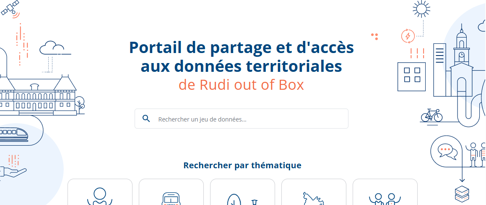
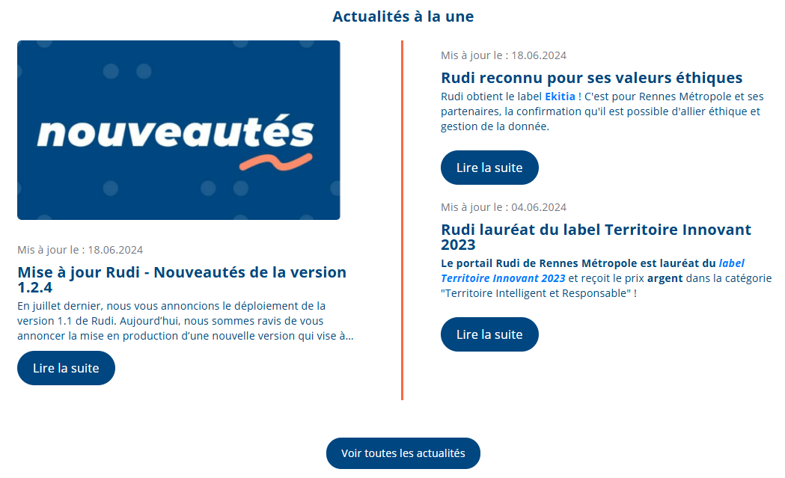
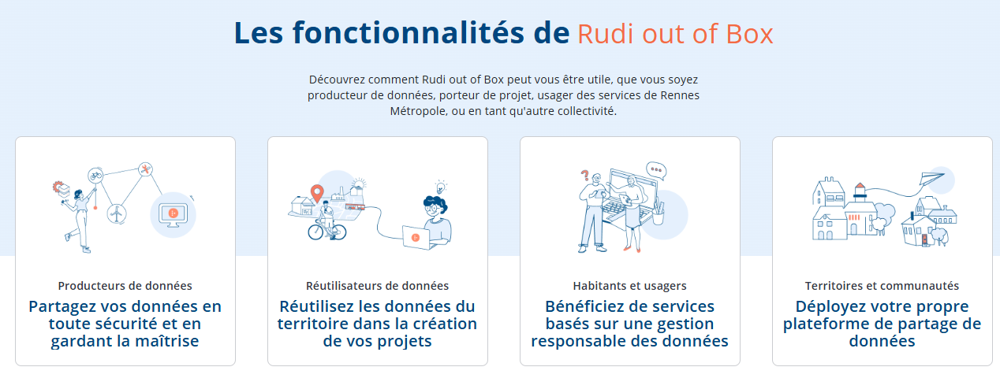
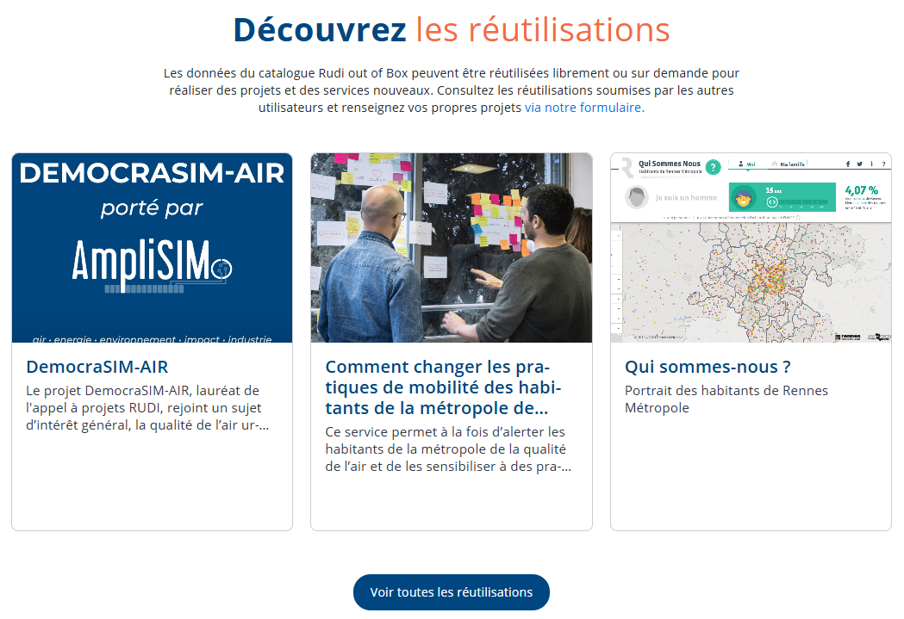
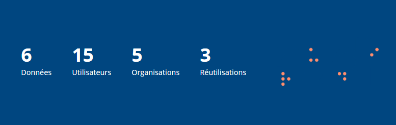
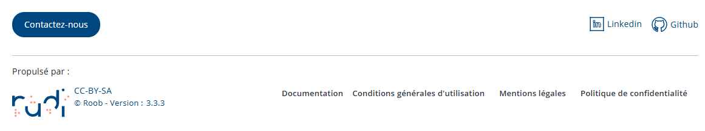

# Comment personnaliser la page d'accueil de mon instance RUDI ROOB ?

_Cas d'usage_ : je souhaite modifier l'apparence de la page d'accueil de mon instance RUDI.

## Présentation

Le contenu de la page d'accueil est géré par des fichiers de configuration du microservice `konsult`, en particulier les fichiers `customization.json` et `konsult-front-office.json` dans le répertoire `config/konsult`.

Lorsque les fichiers de configuration sont modifiés, il est nécessaire de redémarrer le microservice `konsult` pour que les modifications soient prises en compte.

## Modifier le logo du header de la page d'accueil

La section suivante explique comment modifier les images affichées dans la page d'accueil. 

L'exemple porte sur le logo affiché dans le header, mais la démarche est similaire pour toutes les autres images utilisées dans la page d'accueil.

### Déposer la nouvelle image

Créer un dossier `mes_logos` dans le dossier `config/konsult`.

Déposer la nouvelle image dans ce dossier, par exemple `logo_principal.png`, 

### Prise en compte de la nouvelle image

Modifier le fichier `config/konsult/customization.json` pour indiquer les nouveaux noms de fichiers.

Pour modifier le logo du header et son texte alternatif, modifier le fichier comme suit :

```json
{
    ...
    "mainLogo": "/mes_logos/logo_principal.png",
	"mainLogoAltText": "Mon logo principal personnalisé",
    ...
}
```

Redémarrer le microservice `konsult` pour prendre en compte les modifications.

## Section `hero`

Cette section permet de modifier les textes et les images utilisés dans la partie "hero" de la page d'accueil.



Cette section est configurable dans le fichier `config/konsult/customization.json`.

```json
{
    ...
	"heroDescription": {
		"leftImage": "/assets/hero/left-image.png",
		"rightImage": "/assets/hero/right-image.png",
		"titles1": [
			{
				"locale": "fr_FR",
				"text": "Portail de partage et d'accès aux données territoriales"
			},
			{
				"locale": "en_GB",
				"text": "Territorial data shared and access"
			}
		],
		"titles2": [
			{
				"locale": "fr_FR",
				"text": "de Rudi out of Box"
			},
			{
				"locale": "en_GB",
				"text": "for Rudi out of Box"
			}
		]
	}
    ...
}
```

## Section "Actualités à la une"



Cette section est configurable dans le fichier `config/konsult/customization.json`.

```json
{
    ...
    "cmsNewsDescription": {
		"category": "/rudi/news",
		"alauneCategory": "/rudi/news/a-la-une",
		"templateDetailed": "rudi-news@one-news-detailed",
		"templateSimple": "rudi-news@one-news",
		"templateSimpleWithImage": "rudi-news@one-news-with-image",
		"templateNewsList": "rudi-news@one-news-with-image-card",
		"newsListPath": "cms/news/rudi-news@one-news-with-image-card"
	}
    ...
}
```

Les paramètres utilisés correspondent à des contenus et des templates définis dans Magnolia.

Pour modifier l'apparence des cartes affichées dans cette section, il est nécessaire de modifier les templates dans Magnolia.

Les contenus affichés dans cette section sont gérés depuis Magnolia.

### Configuration de la page "Toutes les actualités"

La page "Toutes les actualités" est configurable dans le fichier `config/konsult/customization.json` (Texte et liste de tri).

```json
{
    ...
    "newsPageDescription": {
		"titles1": [
			{
				"locale": "fr_FR",
				"text": "Découvrir"
			},
			{
				"locale": "en_GB",
				"text": "Discover"
			}
		],
		"titles2": [
			{
				"locale": "fr_FR",
				"text": "toutes les actualités"
			},
			{
				"locale": "en_GB",
				"text": "all news"
			}
		],
		"orders": [
			{
				"libelles": [
					{
						"locale": "fr_FR",
						"text": "La plus récente"
					}
				],
				"value": "-publishdate"
			},
			{
				"libelles": [
					{
						"locale": "fr_FR",
						"text": "La plus ancienne"
					}
				],
				"value": "publishdate"
			}
		]
	}
    ...
}
```

## Section "Les fonctionnalités de Rudi out of Box"



Cette section est configurable dans le fichier `config/konsult/customization.json`.

```json
    ...
	"cmsProjectValuesDescription": {
		"titles1": [
			{
				"locale": "fr_FR",
				"text": "Les fonctionnalités de"
			},
			{
				"locale": "en_GB",
				"text": "The features of"
			}
		],
		"titles2": [
			{
				"locale": "fr_FR",
				"text": "Rudi out of Box"
			},
			{
				"locale": "en_GB",
				"text": "Rudi out of Box"
			}
		],
		"descriptions": [
			{
				"locale": "fr_FR",
				"text": "Découvrez comment Rudi out of Box peut vous être utile, que vous soyez producteur de données, porteur de projet, usager des services de Rennes Métropole, ou en tant qu'autre collectivité."
			},
			{
				"locale": "en_GB",
				"text": "Find out how Rudi out of Box can help you, whether you're a data producer, a project developer, a user of Rennes Métropole services, or another local authority."
			}
		],
		"category": "/rudi/projectvalues",
		"mainCategory": "/rudi/projectvalues/main",
		"templateDetailed": "rudi-project-values@one-projectvalue-detailed",
		"templateSimple": "rudi-project-values@one-projectvalue"
	},
    ...
```

Les valeurs utilisées dans les paramètres `category`, `mainCategory`, `templateDetailed` et `templateSimple` correspondent à des valeurs et des templates définis dans Magnolia.

Pour modifier l'apparence des cartes affichées dans cette section, il est nécessaire de modifier les templates dans Magnolia.

## Section "Découvrez les réutilisations"



Cette section est configurable dans le fichier `config/konsult/customization.json`.

```json
{
    ...
    "projectsDescription": {
		"titles1": [
			{
				"locale": "fr_FR",
				"text": "Découvrez"
			},
			{
				"locale": "en_GB",
				"text": "Discover"
			}
		],
		"titles2": [
			{
				"locale": "fr_FR",
				"text": "les réutilisations"
			},
			{
				"locale": "en_GB",
				"text": "for Rudi out of Box"
			}
		],
		"subtitles": [
			{
				"locale": "fr_FR",
				"text": "Les réutilisations Rudi out of Box"
			},
			{
				"locale": "en_GB",
				"text": "Rudi out of Box reuses"
			}
		],
		"descriptions": [
			{
				"locale": "fr_FR",
				"text": "Les données du catalogue Rudi out of Box peuvent être réutilisées librement ou sur demande pour réaliser des projets et des services nouveaux. Consultez les réutilisations soumises par les autres utilisateurs et renseignez vos propres projets "
			},
			{
				"locale": "en_GB",
				"text": "Rudi out of Box catalog data can be reused freely or on request to create new projects and services. Consult the re-uses submitted by other users and enter your own projects"
			}
		]
	}
    ...
}
```

## Section "Chiffres clés"

Cette section permet de modifier les textes et l'image utilisés dans la partie "Chiffres clés" de la page d'accueil.



Cette section est configurable dans le fichier `config/konsult/customization.json`.

```json
{
    ...
    "keyFiguresDescription": {
		"keyFiguresLogo": "/assets/keyFigures/key-figures-logo.png",
		"keyFigures": [
			{
				"type": "DATASET",
				"labels": [
					{
						"locale": "fr_FR",
						"text": "Données"
					},
					{
						"locale": "en_GB",
						"text": "Data"
					}
				]
			},
			{
				"type": "USER",
				"labels": [
					{
						"locale": "fr_FR",
						"text": "Utilisateurs"
					},
					{
						"locale": "en_GB",
						"text": "Users"
					}
				]
			},
			{
				"type": "ORGANIZATION",
				"labels": [
					{
						"locale": "fr_FR",
						"text": "Organisations"
					},
					{
						"locale": "en_GB",
						"text": "Organizations"
					}
				]
			},
			{
				"type": "PROJEKT",
				"labels": [
					{
						"locale": "fr_FR",
						"text": "Réutilisations"
					},
					{
						"locale": "en_GB",
						"text": "Reuses"
					}
				]
			}
		]
	}
    ...
}
```

Les chiffres clés sont automatiquement mis à jour en fonction des données présentes dans l'instance RUDI.

## Modifier le footer de la page d'accueil



Le footer de la page d'accueil est configurable à l'aide des fichiers `config/konsult/customization.json` et `config/konsult/konsult-front-office.json`.

Dans le fichier `customization.json`, il est possible de modifier le logo, son texte alternatif, ainsi que l'URL cible et les liens vers les réseaux sociaux et leurs logos dans cette section :

```json
{
    ...
	"footerDescription": {
		"footerLogo": {
			"logo": "/assets/footer/logo.svg",
			"url": "https://rudi.fr",
			"logoAltText": "Logo bleu orange beta de rennes metropole"
		},
		"socialNetworks": [
			{
				"label": "Linkedin",
				"url": "https://www.linkedin.com/company/portail-rudi",
				"icon": "/assets/footer/linkedin.svg"
			},
			{
				"label": "Github",
				"url": "https://github.com/rudi-platform/rudi-portal",
				"icon": "/assets/footer/github.svg"
			}
		]
	},
    ...
}
```

Les cibles des liens "Contactez-nous" et "Documentation" sont configurés dans le fichier `konsult-front-office.json` :

```json
{
    ...
    "front": {
		"contact": "https://rudi.fr/contact/",
        "docRudi": "https://doc.rudi.fr/",
        ...
    },
    ...
}
```

Les autres liens du footer sont configurés dans Magnolia et figurent dans la section `cmsTermsDescription`.

```json
{
    ...
	"cmsTermsDescription": {
		"category": "/rudi/terms",
		"cguCategory": "/rudi/terms/cgu",
		"legalMentionCategory": "/rudi/terms/legal-mention",
		"privacyPolicyCategory": "/rudi/terms/privacy-policy",
		"copyrightsCategory": "/rudi/terms/copyrights",
		"templateDetailed": "rudi-terms@one-term-detailed",
		"templateSimple": "rudi-terms@one-term"
	},
    ...
}
```

## Autres personnalisations possibles

D'autres éléments de personnalisation sont disponibles en modifiant le fichier `config/konsult/konsult-front-office.json`.

```json
{
    ...
	"front": {
		"apiDocumentation": "https://rudi-platform.github.io/rudi-documentation/api/authentification/",
		"apiDocumentationService": "https://rudi-platform.github.io/rudi-documentation/",
		"tableDisplayMaxFileSize": "1000000000",
		"datasetHelpLinks": [
			{
				"key": "restricted",
				"url": "https://doc.rudi.fr/acces_donnees_restreintes/acces_donnees"
			},
			{
				"key": "open",
				"url": "https://doc.rudi.fr/acces_donnee_ouverte/acces_donnee_ouverte_media_type_API"
			},
			{
				"key": "selfdata",
				"url": "https://doc.rudi.fr/donnees_personnelles/intro"
			}
		]
	},
    ...
}
```

* `apiDocumentation` : lien vers la documentation de l'API d'authentification RUDI, affichée dans le détail des jeux de données de votre réutilisation
* `apiDocumentationService` : lien vers la documentation de RUDI, affichée dans le détail des jeux de données de votre réutilisation
* `tableDisplayMaxFileSize` : taille maximale des fichiers (en octets) pour lesquels un aperçu en tableau est proposé dans le catalogue de données
* `datasetHelpLinks` : liens d'aide affichés dans la section "Téléchargements" du détail des jeux de données


```json
{
    ...
	"mapInfo": {
		"defaultCenter": [-1.662712, 48.114767],
		"defaultTopLeft": [-1.751289, 48.168261],
		"defaultBottomRight": [-1.534996, 48.062135],
		"paddingExtent" : 40,
		"maxZoomExtent" : 11,
		"defaultZoom" : 13
	},
    ...
}
```

* `mapInfo` : configuration de la carte affichée dans le détail des jeux de données géographiques. Par défaut, la carte est centrée sur Rennes Métropole.

```json
{
    ...
	"scripts": [
	]
    ...
}
```

* `scripts` : liste de scripts JavaScript personnalisés à charger dans le front-office de Konsult. Voir la section [Comment charger un script javascript personnalisé dans mon instance RUDI ROOB ?](./configuration-custom-js.md) pour plus de détails.